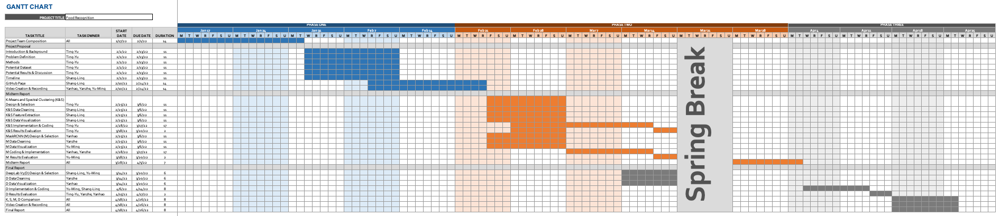
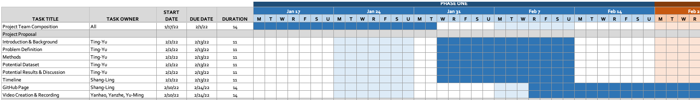
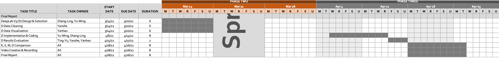

# Food Recognition
 
## Introduction/Background & Problem Definition
Food is inseparable from our daily life. This project aims to recognize food at a pixel level, in other words, instance segmentation. We believe a food recognizer is a helpful tool and can be applied to multiple fields of applications. For example, it helps people keep track of their daily diet and provides information for better medical support. Moreover, our segmentation project can be further extended to different application fields, such as home automation and supply chain management.
 
Our dataset comes from AIcrowd Food Recognition Benchmark, an ongoing food recognition challenge provided by Seerave Foundation (Mohanty and Khandelwal 2021). We plan to use data from its round 2 challenge, which starts on March 1st, 2022. To the best of our knowledge, AIcrowd has already released data for 498 food classes with 39,962 training samples and  76,491 food item annotations in MS-COCO format (Lin et al. 2014). They are planning to release more data for the upcoming round 2 challenge, while the exact number is yet to be released. We will temporarily work with the data from round 1 before the release date.
 
## Methods
We will implement both unsupervised and supervised machine learning algorithms and compare their results. For unsupervised learning, we will implement two types of feature extractors: (1) color features extractor through PCA (2) color and spatial information extractor through RBF kernel. Then, we will use k-means and spectral clustering for segmentation. Moreover, we will try to initial center with both random and k-means++ methods. As to supervised learning, we will use MaskRCNN (He et al. 2017) and DeepLab V3 (Chen et al. 2017). No prior feature extraction is needed for these two models.  
 
## Potential Results and Discussion
This project follows AIcrowd’s evaluation method, which is COCO detection evaluation metrics. To be more specific, we will evaluate the models by average precision (AP) and average recall (AR) with 0.5:0.05:0.95 Intersection over Union (IoU) threshold.
 
We expect supervised learning to perform better than unsupervised learning. This is due to the robust feature extractor in modern deep neural networks. Moreover, labels provide models with important clues to learn better. 
 
According to the participation regulation of the challenge (Mohanty and Khandelwal 2021), we will report both the score we computed on 100% of the publicly released test set, as well as the one evaluated by the contest system on 40% of an unreleased extended test set.
 
## Timeline
We distribute the jobs equally across time and team members. K-Means and Spectral Clustering can be similar in implementation if we make use of Scikit-Learn (Pedregosa et al. 2011), while deep learning based model may be more complex. Hence, we allocate the labor accordingly.
 
### Overall Gantt Chart

### Phase One: Project Team Creation and Proposal

 
### Phase Two: K-Means, Spectral Clustring, MaskRCNN, and Midterm Report

 
### Phase Three: DeepLab V3 and Final Report

 
## References
* Chen, Liang-Chieh, George Papandreou, Florian Schroff, and Hartwig Adam. "Rethinking atrous convolution for semantic image segmentation." arXiv preprint arXiv:1706.05587 (2017).
* He, Kaiming, Georgia Gkioxari, Piotr Dollár, and Ross Girshick. "Mask r-cnn." In Proceedings of the IEEE international conference on computer vision, pp. 2961-2969. 2017.
* Lin, Tsung-Yi, Michael Maire, Serge Belongie, James Hays, Pietro Perona, Deva Ramanan, Piotr Dollár, and C. Lawrence Zitnick. "Microsoft coco: Common objects in context." In European conference on computer vision, pp. 740-755. Springer, Cham, 2014.
* Mohanty, Sharada, and Shivam Khandelwal. “Food Recognition Benchmark 2022: Challenges.” AIcrowd. Seerave Foundation, November 22, 2021. https://www.aicrowd.com/challenges/food-recognition-benchmark-2022. 
* Pedregosa, Fabian, Gaël Varoquaux, Alexandre Gramfort, Vincent Michel, Bertrand Thirion, Olivier Grisel, Mathieu Blondel et al. "Scikit-learn: Machine learning in Python." the Journal of machine Learning research 12 (2011): 2825-2830.
