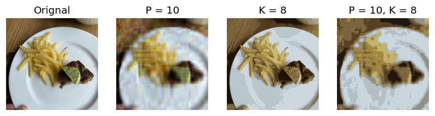
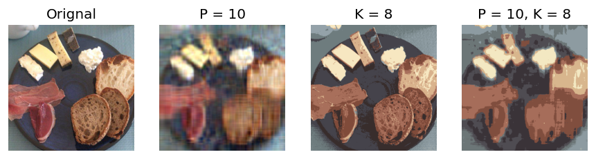
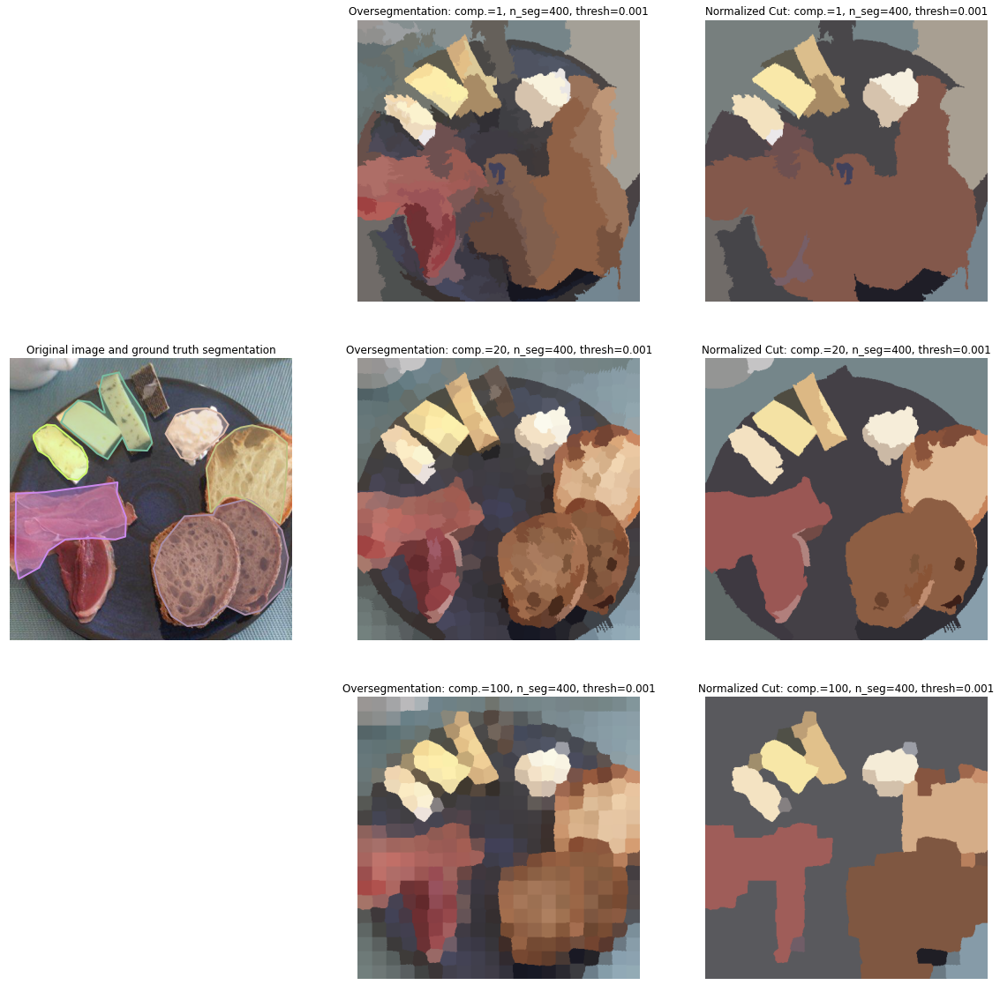

# Food Recognition
 
## Introduction/Background & Problem Definition
Food is inseparable from our daily life. This project aims to recognize food at a pixel level, in other words, instance segmentation. We believe a food recognizer is a helpful tool and can be applied to multiple fields of applications. For example, it helps people keep track of their daily diet and provides information for better medical support. Moreover, our segmentation project can be further extended to different application fields, such as home automation and supply chain management.
 
Our dataset comes from AIcrowd Food Recognition Benchmark, an ongoing food recognition challenge provided by Seerave Foundation (Mohanty and Khandelwal 2021). We use the data from its round-2 challenge, which started in early March of 2022. AIcrowd released data for 498 food classes with 39,962 training samples and 76,491 food item annotations in MS-COCO format (Lin et al. 2014) for the 1st round of the challenge ("v2.0"). For the 2nd round ("v2.1"), they released a dataset containing a training set of 54,392 images of food items, with 100,256 annotations spread over 323 food classes. To fit our project to the challenge timeline, we mainly work with the v2.1 (round 2) data throughout this report.
 
## Methods
We implemented both unsupervised and supervised machine learning algorithms and compared their results. For unsupervised learning, we implemented a clustering-based method, K-means, and graph-based method, Normalized Cut. We used a color feature extractor through PCA for K-means, and a similar clustering-based pre-processing step for Normalized Cut to extract local information while reducing the computational complexity. As to supervised learning, we used Hybrid Task Cascade based on MaskRCNN (He et al. 2017), where no prior feature extraction is needed.
### Unsupervised Instance Segmentation
#### K-means
We first utilize k-means clustering to have a simple analysis of this problem. K-means aims to partition n observations into k clusters in which each observation belongs to the cluster with the nearest mean. The scikit-learn package minimizes within-cluster variances (squared Euclidean distances) to do the clustering. Besides running k-means on the raw images, we also evaluate the performance by preprocessing the figures to the compressed figures via extracting the color features through PCA.

#### Spectral Clustering (Normalized Cut)
We also assessed graph-based segmentation techniques on this task. Specifically, we chose to implement the normalized cut algorithm (Shi et al., 2000), in which each image is represented as a weighted undirected complete graph, and the instance segmentation problem is then formulated as a graph partitioning problem, so that the vertices in the same sets have high similarity and vertices in two different sets have low similarity. Since finding tshe optimal min-cut is a NP-hard problem, normalized cut computes an approximate solution by solving the generalized eigenvalue problem on the affinity matrix. The overall algorithm can be described as follows:

1. Run K-means clustering with a relative big K on the original image with color and spatial location as features to obtain an oversegmentation of the image (superpixels). This step would significantly improve the computational efficiency, while preserving the features of the main groups/regions of pixels.
2. Construct a Region Adjacency Graph on the segments from step 1, where the features of each node is represented by the average color of pixels in the region, while the weight between two adjacent nodes is given by their exponential similarity of Euclidean distance .
3. Compute the unnormalized Laplacian , and then solve the generalized eigenproblem  for eigenvectors with the smallest eigenvalues.
4. Use the eigenvector with the second smallest eigenvalue to bipartition the graph.
5. Check the stability of the cut, and recursively reparitition the segmened parts if necessary.

We used scikit-learn/scikit-image for performing the K-means oversegmentation, generating the Region Adjacency Graph, solving the eigenproblem, performing the 2-way normalized cut, and visualizing the segmentation results. Specifically, there are several parameters that might impact the overall quality of the segmentation results:
- compactness: Controls the balance between color proximity and space proximity in the oversegmentation step.
- n_segments: Essentially serves as the $K$ in the K-means oversegmentation step.
- ncut_threshold: Determines the stability requirement for the final graph partition.
  
Despite the fact that the ideal choice of each parameters vary a lot among images with instances of different scales, we chose a generally suitable parameter set for evalution: compactness=20, n_segments=400, ncut_threshold=.0001.

### Supervised Instance Segmentation

Supervised instance segmentation has three components: detection, classification, segmentation. In detection, model is trained to generate bounding boxes that contain objects. Given a bounding box, classification requires the model to predict which category does the bounded object belongs to. The segmentation step need models to give every pixel in the bounding box a label: whether this pixel belongs to the object.

**Mask R-CNN** is the milestone of instance segmentation in this deep learning era. After using convolution networks to extract a feature map for the whole image, Region Proposal Network (RPN, Ren et al., 2015) uses sliding windows to output a set of rectangular object proposals (bounding box). For each candidate box, a Region-of-Interest (RoI) Pooling layer (Girshick, 2015) transforms its feature into a fixed size using maxpooling, then we feed it into a classifier and a regression model for object classification (for the classication step) and bounding box location (for the detection step). To further achieve the segmentation step, Mask R-CNN uses Fully Convolutional Network (FCN, Long et al., 2015) to output a binary mask on each ROI, assigning a binary value to each pixel to indicate whether that pixel belongs the object.

**Our Approach** In this project, we use an improved version of Mask R-CNN, called **Hybrid Task Cascade** (HTC, Chen et al., 2019). Cascade is a classic idea that boosts model performance by multi-stage refinement. In our case, cascade could be implented by the step-by-step refinement of the bounding box and the segmentation mask. (i) *Bounding Box Cascade*: Note that the regression model after RoI pooling layer locate the bounding box given a region's feature, so HTC further use the output bounding box to form a region feature, then use the RoI pooling layer and the regression model to get a refined bounding box. (ii) *Segmentation Mask Cascade*: HTC introduces an information flow between masks by enabling generating refined binary masks conditioning on previously generated masks. (iii) *Auxiliary Semantic Segmentation*: Beyond cascade, to further help the masking process to distinguish the object and the background, HTC further leverages an extra semantic segmentation branch (also a FCN) to provide extra semantic information of the whole image, then let the mask generation process condition on the semantic information of each pixel.

## Results and Discussion
<!-- This project follows AIcrowd’s evaluation method, which is COCO detection evaluation metrics. To be more specific, we will evaluate the models by average precision (AP) and average recall (AR) with 0.5:0.05:0.95 Intersection over Union (IoU) threshold.
 
We expect supervised learning to perform better than unsupervised learning. This is due to the robust feature extractor in modern deep neural networks. Moreover, labels provide models with important clues to learn better. 
 
According to the participation regulation of the challenge (Mohanty and Khandelwal 2021), we will report both the score we computed on 100% of the publicly released test set, as well as the one evaluated by the contest system on 40% of an unreleased extended test set. -->

### K-means
For K-means, we repeat the process by setting different k for cluster number and p for principle components to find a proper result. After evaluating several pictures by elbow methods, we find that most figures have a good performance for k = 8

Thus, We decided to set our k = 8 and p = 10 for comparasion. 

From the figures, we can find that Kmeans preserve the boundary of the instances well and have a decent performance to filter out single food. However, the second figure makes it hard to detect bread and meat, which have similar colors even if they are far from each other. This is due to the natural fact of we use Kmeans to distinguish color instead of the distance between instances.  
### Normalized Cut
As is described above, the normalized cut algorithm first use K-means to segment the image into a large number of superpixels, and then use the derived regions construct a similarity graph, after which recursive 2-way normalized cut is performed. Here gives a couple of samples output of the normalized cut algorithm, in the order of original image, superpixels, and final segmentation proposals (compactness=20, n_segments=400, ncut_thresh=.001). Each proposed region is displayed as the mean color of all pixels in the region.

One can see that the algorithm generally does a good job in differentiating food instances, while preserving the boundaries of each instances. Also, since there is no need to specify the total number of segments in the clustering result, the algorithm is able to deal with arbitraty number of instances to segment. However, this characteristic also introduces some problems, as some small segments are unnecessarily seperated. We attempted to minimize the influence by setting a threshold for the ratio of the size of each seperated region to the total size of the image. In the evaluation phase, the threshold is set to 1.5%.

We further compared the segmentation results with different parameter setting.

With a low compactness setting in the oversegmentation step, pixels with similar colors tend to be grouped together, rather than the pixels spatially closer to it. With a high compactness score, however, the resulting oversegmentation looks more like superpixels, as the spatial proximity highly overweigh the color similarity. Therefore, a medium compactness setup is needed for balancing the two, so as to pertain object boundaries and capture the main characteritics.

The threshold for the n_cut algorithm basically determine when the iterative graph cut should terminate. Higher threshold will lead to early termination, which lead to higher number of segmentations. Setting a low threshold might be a generally better practice for the food instance segmentation problem, as we will not expect too fine-grained segmentation. However, setting a threshold that is too low might result in insufficient segmentation, and in extreme cases, labeling the full image into a single label when the contrast is not big enough.
### Hybrid Task Cascade

In supervised instance segmentation, we put the ground truth on the left, the predicted bounding box and segmentation mask on the right. We can observe that the HTC model can roughly detect, classify and segment the food in the image (e.g. salmon in the first image, meat/bread/cheese in the second image, french fried in the third image). However, the gap between the ground truch segmentation and the predicted segmentation is still obvious:
1. While the model can predict the region containing food correctly, it cannot predict the correct border in detail. For example, the groundtruch borders between the food and the background are more detailed for the salmon and the french fries in the first and third images.
2. The model can classify the food objects in general, it still cannot map them to fine-grained categories. For example, in the second image, the model can correctly predict general classes such as "cheese" and "bread", but it cannot distinguish "soft cheese" and "hard cheese", "bread with whole wheat" and "bread".

### Quantitative Results
<!-- Besides, we also assess the unsupervised segmentation results using internal clustering measures such as Probabilistic Random Index (PRI), Variation of Information (VoI), and Segmentation Covering. -->

#### Unsupervised Instance Segmentation

For unsupervised methods, we generally follows the same evaluation metric as the standard supervised one, i.e. calculate AP and AR with IoU=0.50. since they are generally unable to predict specific classes, we calculate the metric without taking the class labels into consideration. In other words, a segmentation proposal will be considered as a truth positive as long as it achieves higher IoU with any of the ground-truth of food instance segmentations than the threshold. 

We evaluate K-Means and Normalized Cut with a fixed set of parameters (for computational efficiency) on the full validation set (946 images). For K-Means with K=8 and P=10, inference on the validation set gives AP=0.2, AR=3.5, while Normalized Cut with compactness=20, n_segments=400, and thresh=.001 reports AP=1.7, AR=12.2. According to the reported metrics, Normalized Cut generally performs better than K-Means (with static parameter setting), which might because Normalized Cut better utilizes the spatial information of the data, and it is able to better preserve the boundaries between objects/instances.

It's worth mentioning that the reported metrics for both unsupervised methods are below expectation (according to performance reports from prior works on similar tasks such as image sementic segmentation). This might because in our dataset, only food instances , and current implementations of the two unsupervised methods make no efforts to distinguish between the foreground and background, and thus might predict a lot more segmentations from the background (e.g. plate, hand, tableware, etc.), which might be a valid segmentation but not a true image instance. Also, since the evaluation module is directly adapted from pycocotools implementations for class-sensitive evaluations with minor modifications, more experiments should be conducted to investigate the correctness.

For the potential next steps, the K-means algorithm can be refined by allowing adaptive parameter choosing (e.g. choose K for K-means when the Davies-Bouldin score is minimized), and the normalized cut algorithm can be refined by setting the label of small regions by sampling from neighbor pixels or using the label from neighbor nodes in the Region Adjacency Graph, rather than directly assigning to background. Besides, if time allows, we might make some attempts on unsupervised domain transfer based on neural models trained on similar tasks, which might allow better comparison with the supervised approaches.

#### Supervised Instance Segmentation

Following the standard COCO evluation and the guideline from the AIcrowd Food Recognition Benchmark, we report the average precision (AP) and average recall(AR) for both bounding box and segmentation mask on the official validation set, while we further average the results varying Intersection over Union (IoU) value from 0.50 to 0.95 (step = 0.05).

| Target | AP (IoU=.50:.05:.95) | AR (IoU=.50:.05:.95) |
| ------ | -------------------- | -------------------- |
| BBox   | 19.5                 | 40.9                 |
| Mask   | 21.6                 | 42.2                 |

Comparing the results we get to the state-of-the-art results on COCO datasets (AP of more than 40), the gap is still big (though we are using the same data). There are several possible reasons: 
1. Instead of detecting people and cars in daily-life images, it is more challenging to correctly detect and segment food objects, due to the similar background, color, size and texture of food images.
2. Non-optimal hyperparameters. Due to the limitation of computation, we haven't carefully tune the hyperparameter according to the validation set. Our device limits the maximum batch size we can try (no more than 4). Also, HTC nearly doubles the training time of mask R-CNN, which makes it even harder for us to find the optimal hyperparameters.

For the possible next steps, we plan to leverage more recent instance segmentation approaches which either refines HTC to achieve better results or achieve higher efficiency to make hyperparameter search eaiser. Specifically, there are several candidiate for future exploration:
1. SCNet (Vu et al., 2021) leverages feature relay and utilizes global contextual information to explicitly target the mismatch problem in HTC:  The outputs of all the box stages are used for mask predictions during training, but only the output of the last box stage is used for mask predictions during inference. We hopt SCNet can help us directly improve the performance of HTC without extensively tuning hyperparameters.
2. SOLO (Wang et al,. 2020) assigns categories to each pixel within an instance according to the instance’s location and size in order to form instance segmentation as a single-shot classification-solvable problem. SOLO is shown to achieve the same efficiency but higher performance on COCO datasets, we hope it can help us to speed up the training process and make hyperparameter tuning easier.

## References
* Chen, Liang-Chieh, George Papandreou, Florian Schroff, and Hartwig Adam. "Rethinking atrous convolution for semantic image segmentation." arXiv preprint arXiv:1706.05587 (2017).
* He, Kaiming, Georgia Gkioxari, Piotr Dollár, and Ross Girshick. "Mask r-cnn." In Proceedings of the IEEE international conference on computer vision, pp. 2961-2969. 2017.
* Lin, Tsung-Yi, Michael Maire, Serge Belongie, James Hays, Pietro Perona, Deva Ramanan, Piotr Dollár, and C. Lawrence Zitnick. "Microsoft coco: Common objects in context." In European conference on computer vision, pp. 740-755. Springer, Cham, 2014.
* Mohanty, Sharada, and Shivam Khandelwal. “Food Recognition Benchmark 2022: Challenges.” AIcrowd. Seerave Foundation, November 22, 2021. https://www.aicrowd.com/challenges/food-recognition-benchmark-2022. 
* Pedregosa, Fabian, Gaël Varoquaux, Alexandre Gramfort, Vincent Michel, Bertrand Thirion, Olivier Grisel, Mathieu Blondel et al. "Scikit-learn: Machine learning in Python." the Journal of machine Learning research 12 (2011): 2825-2830.
* Shi, J.; Malik, J., “Normalized cuts and image segmentation”, Pattern Analysis and Machine Intelligence, IEEE Transactions on, vol. 22, no. 8, pp. 888-905, August 2000.
* Chen, Kai, Jiangmiao Pang, Jiaqi Wang, Yu Xiong, Xiaoxiao Li, Shuyang Sun, Wansen Feng et al. "Hybrid task cascade for instance segmentation." In Proceedings of the IEEE/CVF Conference on Computer Vision and Pattern Recognition, pp. 4974-4983. 2019.
* Ren, Shaoqing, Kaiming He, Ross Girshick, and Jian Sun. "Faster r-cnn: Towards real-time object detection with region proposal networks." Advances in neural information processing systems 28 (2015).
* Girshick, Ross. "Fast r-cnn." In Proceedings of the IEEE international conference on computer vision, pp. 1440-1448. 2015.
* Long, Jonathan, Evan Shelhamer, and Trevor Darrell. "Fully convolutional networks for semantic segmentation." In Proceedings of the IEEE conference on computer vision and pattern recognition, pp. 3431-3440. 2015.
* Vu, Thang, Haeyong Kang, and Chang D. Yoo. "Scnet: Training inference sample consistency for instance segmentation." In Proceedings of the AAAI Conference on Artificial Intelligence, vol. 35, no. 3, pp. 2701-2709. 2021.
* Wang, Xinlong, Tao Kong, Chunhua Shen, Yuning Jiang, and Lei Li. "Solo: Segmenting objects by locations." In European Conference on Computer Vision, pp. 649-665. Springer, Cham, 2020.
