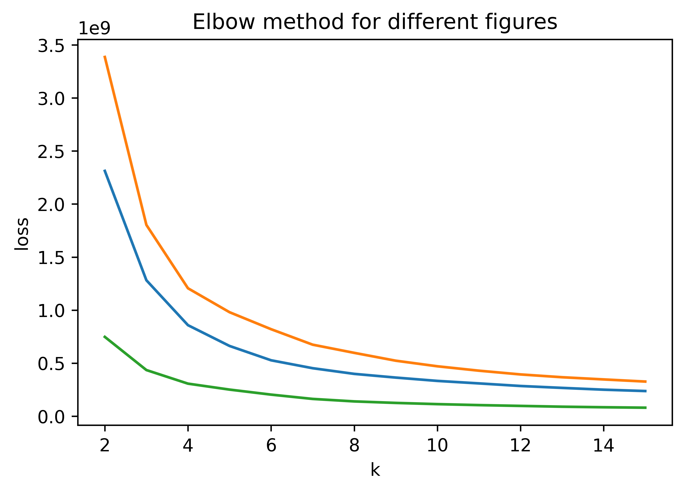
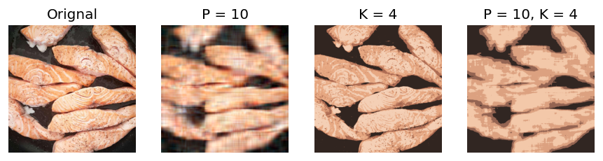

# Food Recognition
 
## Introduction/Background & Problem Definition
Food is inseparable from our daily life. This project aims to recognize food at a pixel level, in other words, instance segmentation. We believe a food recognizer is a helpful tool and can be applied to multiple fields of applications. For example, it helps people keep track of their daily diet and provides information for better medical support. Moreover, our segmentation project can be further extended to different application fields, such as home automation and supply chain management.
 
Our dataset comes from AIcrowd Food Recognition Benchmark, an ongoing food recognition challenge provided by Seerave Foundation (Mohanty and Khandelwal 2021). We use the data from its round-2 challenge, which started in early March of 2022. AIcrowd released data for 498 food classes with 39,962 training samples and 76,491 food item annotations in MS-COCO format (Lin et al. 2014) for the 1st round of the challenge ("v2.0"). For the 2nd round ("v2.1"), they released a dataset containing a training set of 54,392 images of food items, with 100,256 annotations spread over 323 food classes. To fit our project to the challenge timeline, we mainly work with the v2.1 (round 2) data throughout this report.
 
## Methods
We will implement both unsupervised and supervised machine learning algorithms and compare their results. For unsupervised learning, we will implement two types of feature extractors: (1) color features extractor through PCA (2) color and spatial information extractor through RBF kernel. Then, we will use k-means and spectral clustering for segmentation. Moreover, we will try to initial center with both random and k-means++ methods. As to supervised learning, we will use Hybrid Task Cascade based on MaskRCNN (He et al. 2017). No prior feature extraction is needed for these two models.  
### Unsupervised Instance Segmentation
#### K-means
We first utilize k-means clustering to have a simple analysis of this problem. K-means aims to partition n observations into k clusters in which each observation belongs to the cluster with the nearest mean. The scikit-learn package minimizes within-cluster variances (squared Euclidean distances) to do the clustering. Besides running k-means on the raw images, we also evaluate the performance by preprocessing the figures to the compressed figures via extracting the color features through PCA.

#### Spectral Clustering (Normalized Cut)
We also assessed graph-based segmentation techniques on this task. Specifically, we chose to implement the normalized cut algorithm (Shi et al., 2000), in which each image is represented as a weighted undirected complete graph, and the instance segmentation problem is then formulated as a graph partitioning problem, so that the vertices in the same sets have high similarity and vertices in two different sets have low similarity. Since finding tshe optimal min-cut is a NP-hard problem, normalized cut computes an approximate solution by solving the generalized eigenvalue problem on the affinity matrix. The overall algorithm can be described as follows:

1. Run K-means clustering with a relative big K on the original image with color and spatial location as features to obtain an oversegmentation of the image (superpixels). This step would significantly improve the computational efficiency, while preserving the features of the main groups/regions of pixels.
2. Construct a Region Adjacency Graph on the segments from step 1, where the features of each node is represented by the average color of pixels in the region, while the weight between two adjacent nodes is given by their exponential similarity of Euclidean distance $e^{-|c_1-c_2|^{2} / \sigma}$.
3. Compute the unnormalized Laplacian $L$, and then solve the generalized eigenproblem $Lx=\lambda D x$ for eigenvectors with the smallest eigenvalues.
4. Use the eigenvector with the second smallest eigenvalue to bipartition the graph.
5. Check the stability of the cut, and recursively reparitition the segmened parts if necessary.

We used scikit-learn/scikit-image for performing the K-means oversegmentation, generating the Region Adjacency Graph, solving the eigenproblem, performing the 2-way normalized cut, and visualizing the segmentation results. Specifically, there are several parameters that might impact the overall quality of the segmentation results:
- compactness: Controls the balance between color proximity and space proximity in the oversegmentation step.
- n_segments: Essentially serves as the $K$ in the K-means oversegmentation step.
- ncut_threshold: Determines the stability requirement for the final graph partition.
  
Despite the fact that the ideal choice of each parameters vary a lot among images with instances of different scales, we chose a generally suitable parameter set for evalution: compactness=20, n_segments=400, ncut_threshold=.0001.

### Supervised Instance Segmentation

Supervised instance segmentation has three components: detection, classification, segmentation. In detection, model is trained to generate bounding boxes that contain objects. Given a bounding box, classification requires the model to predict which category does the bounded object belongs to. The segmentation step need models to give every pixel in the bounding box a label: whether this pixel belongs to the object.

**Mask R-CNN** is the milestone of instance segmentation in this deep learning era. After using convolution networks to extract a feature map for the whole image, Region Proposal Network (RPN, Ren et al., 2015) uses sliding windows to output a set of rectangular object proposals (bounding box). For each candidate box, a Region-of-Interest (RoI) Pooling layer (Girshick, 2015) transforms its feature into a fixed size using maxpooling, then we feed it into a classifier and a regression model for object classification (for the classication step) and bounding box location (for the detection step). To further achieve the segmentation step, Mask R-CNN uses Fully Convolutional Network (FCN, Long et al., 2015) to output a binary mask on each ROI, assigning a binary value to each pixel to indicate whether that pixel belongs the object.

**Our Approach** In this project, we use an improved version of Mask R-CNN, called **Hybrid Task Cascade** (HTC, Chen et al., 2019). Cascade is a classic idea that boosts model performance by multi-stage refinement. In our case, cascade could be implented by the step-by-step refinement of the bounding box and the segmentation mask. (i) *Bounding Box Cascade*: Note that the regression model after RoI pooling layer locate the bounding box given a region's feature, so HTC further use the output bounding box to form a region feature, then use the RoI pooling layer and the regression model to get a refined bounding box. (ii) *Segmentation Mask Cascade*: HTC introduces an information flow between masks by enabling generating refined binary masks conditioning on previously generated masks. (iii) *Auxiliary Semantic Segmentation*: Beyond cascade, to further help the masking process to distinguish the object and the background, HTC further leverages an extra semantic segmentation branch (also a FCN) to provide extra semantic information of the whole image, then let the mask generation process condition on the semantic information of each pixel.

### Evaluation
We follow AIcrowd's evaluation method, which is COCO detection evaluation metrics. To be more specific, we evaluate the models by average precision (AP) and average recall (AR) with 0.5:0.05:0.95 Intersection over Union (IoU) threshold. For unsupervised methods, since they are generally unable to predict specific classes, we calculate the metric without taking the class labels into consideration. In other words, a segmentation proposal will be considered as a truth positive as long as it achieves higher IoU with any of the ground-truth of food instance segmentations than the threshold. Besides, we also assess the unsupervised segmentation results using internal clustering measures such as Probabilistic Random Index (PRI), Variation of Information (VoI), and Segmentation Covering.

## Results and Discussion
<!-- This project follows AIcrowd’s evaluation method, which is COCO detection evaluation metrics. To be more specific, we will evaluate the models by average precision (AP) and average recall (AR) with 0.5:0.05:0.95 Intersection over Union (IoU) threshold.
 
We expect supervised learning to perform better than unsupervised learning. This is due to the robust feature extractor in modern deep neural networks. Moreover, labels provide models with important clues to learn better. 
 
According to the participation regulation of the challenge (Mohanty and Khandelwal 2021), we will report both the score we computed on 100% of the publicly released test set, as well as the one evaluated by the contest system on 40% of an unreleased extended test set. -->

### K-means
For K-means, we repeat the process by setting different k for cluster number and p for principle components to find a proper result. After evaluating several pictures by elbow methods, we find that most figures have a good performance for k = 8

Thus, We decided to set our k = 8 and p = 10 for comparasion. 

### Normalized Cut
As is described above, the normalized cut algorithm first use K-means to segment the image into a large number of superpixels, and then use the derived regions construct a similarity graph, after which recursive 2-way normalized cut is performed. Here gives a couple of samples output of the normalized cut algorithm, in the order of original image, superpixels, and final segmentation proposals. Each proposed region is displayed as the mean color of all pixels in the region.

### Hybrid Task Cascade

In supervised instance segmentation, we put the ground truth on the left, the predicted bounding box and segmentation mask on the right. We can observe that the HTC model can roughly detect, classify and segment the food in the image (e.g. salmon in the first image, meat/bread/cheese in the second image, french fried in the third image). However, the gap between the ground truch segmentation and the predicted segmentation is still obvious:
1. While the model can predict the region containing food correctly, it cannot predict the correct border in detail. For example, the groundtruch borders between the food and the background are more detailed for the salmon and the french fries in the first and third images.
2. The model can classify the food objects in general, it still cannot map them to fine-grained categories. For example, in the second image, the model can correctly predict general classes such as "cheese" and "bread", but it cannot distinguish "soft cheese" and "hard cheese", "bread with whole wheat" and "bread".

### Quantitative Results

##### Supervised Instance Segmentation

Following the standard COCO evluation and the guideline from the AIcrowd Food Recognition Benchmark, we report the average precision (AP) and average recall(AR) for both bounding box and segmentation mask on the official validation set, while we further average the results varying Intersection over Union (IoU) value from 0.50 to 0.95 (step = 0.05).

| BBox | AP (IoU=.50:.05:.95) | AR (IoU=.50:.05:.95) |
|------|----------------------|----------------------|
|  HTC |         19.5         |         40.9         |

| Mask | AP (IoU=.50:.05:.95) | AR (IoU=.50:.05:.95) |
|------|----------------------|----------------------|
|  HTC |         21.6         |         42.2         |

<!-- ## Next Steps
### Unsupervised segmentation
unsupervised domain transfer  -->
## References
* Chen, Liang-Chieh, George Papandreou, Florian Schroff, and Hartwig Adam. "Rethinking atrous convolution for semantic image segmentation." arXiv preprint arXiv:1706.05587 (2017).
* He, Kaiming, Georgia Gkioxari, Piotr Dollár, and Ross Girshick. "Mask r-cnn." In Proceedings of the IEEE international conference on computer vision, pp. 2961-2969. 2017.
* Lin, Tsung-Yi, Michael Maire, Serge Belongie, James Hays, Pietro Perona, Deva Ramanan, Piotr Dollár, and C. Lawrence Zitnick. "Microsoft coco: Common objects in context." In European conference on computer vision, pp. 740-755. Springer, Cham, 2014.
* Mohanty, Sharada, and Shivam Khandelwal. “Food Recognition Benchmark 2022: Challenges.” AIcrowd. Seerave Foundation, November 22, 2021. https://www.aicrowd.com/challenges/food-recognition-benchmark-2022. 
* Pedregosa, Fabian, Gaël Varoquaux, Alexandre Gramfort, Vincent Michel, Bertrand Thirion, Olivier Grisel, Mathieu Blondel et al. "Scikit-learn: Machine learning in Python." the Journal of machine Learning research 12 (2011): 2825-2830.
* Shi, J.; Malik, J., “Normalized cuts and image segmentation”, Pattern Analysis and Machine Intelligence, IEEE Transactions on, vol. 22, no. 8, pp. 888-905, August 2000.
* Chen, Kai, Jiangmiao Pang, Jiaqi Wang, Yu Xiong, Xiaoxiao Li, Shuyang Sun, Wansen Feng et al. "Hybrid task cascade for instance segmentation." In Proceedings of the IEEE/CVF Conference on Computer Vision and Pattern Recognition, pp. 4974-4983. 2019.
* Ren, Shaoqing, Kaiming He, Ross Girshick, and Jian Sun. "Faster r-cnn: Towards real-time object detection with region proposal networks." Advances in neural information processing systems 28 (2015).
* Girshick, Ross. "Fast r-cnn." In Proceedings of the IEEE international conference on computer vision, pp. 1440-1448. 2015.
* Long, Jonathan, Evan Shelhamer, and Trevor Darrell. "Fully convolutional networks for semantic segmentation." In Proceedings of the IEEE conference on computer vision and pattern recognition, pp. 3431-3440. 2015.
